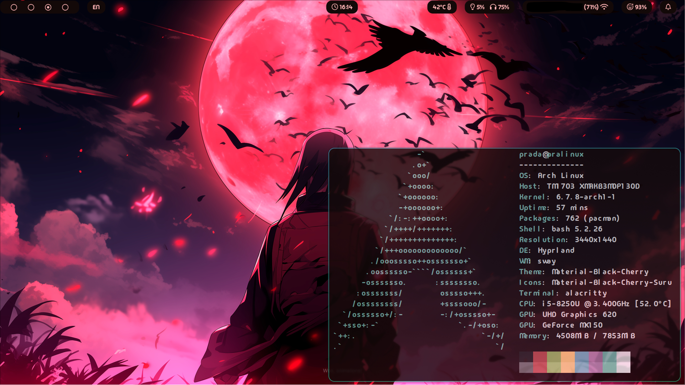

#  Dotfiles
Config files i am currently using in my hyprland setup.



## Dependencies
```
hyprland
alacritty
tofi
fastfetch
waybar
swaync
thunar
hyprshot
firefox
code
nwg-look
```
### Theme and font
```
Font: Madimi One
Theme: Material-Black-Cherry
Icons: Material-Black-Cherry-Suru
```

## TODO


-  Set up and customize rofi launcher and delete tofi
- Do a simple installation guide

