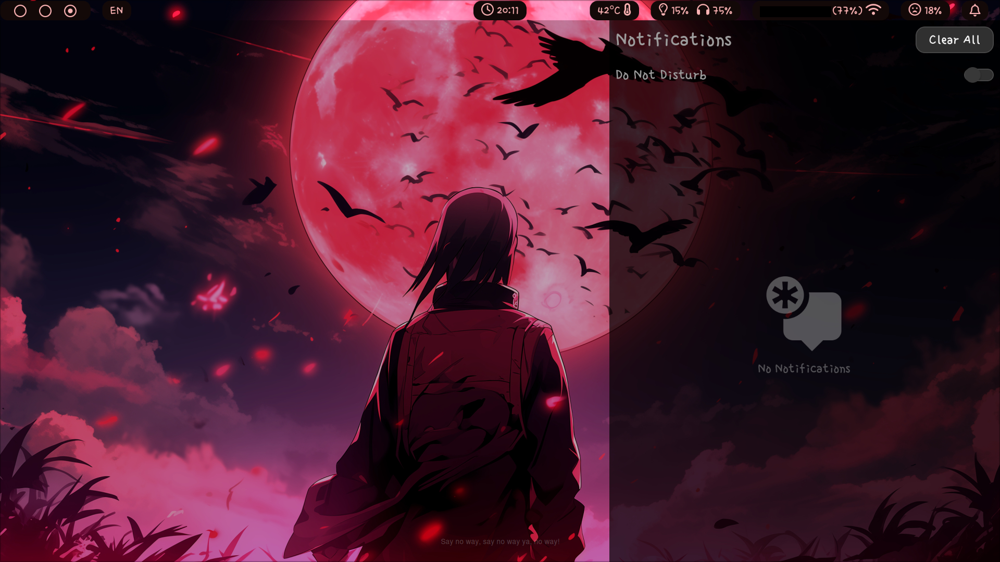
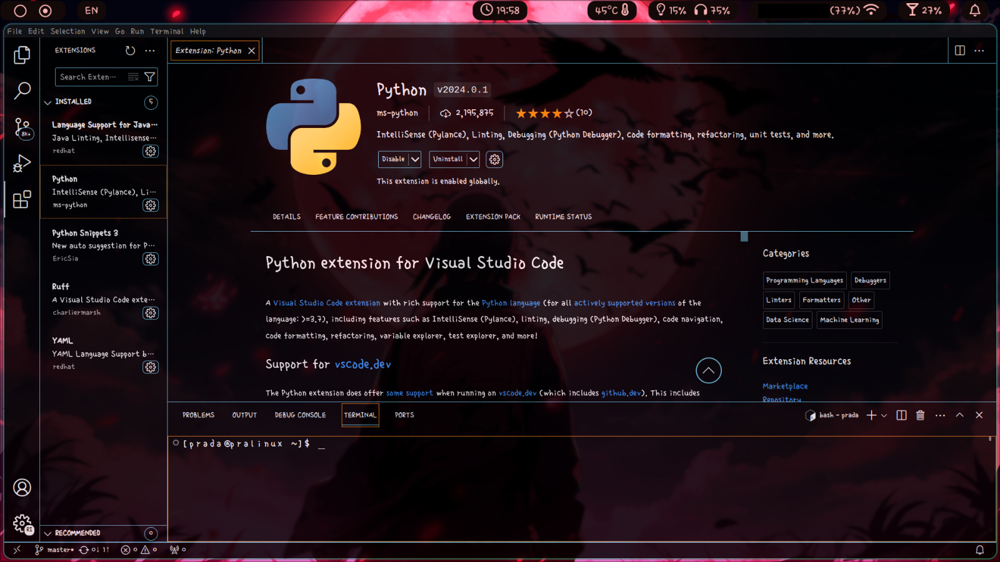
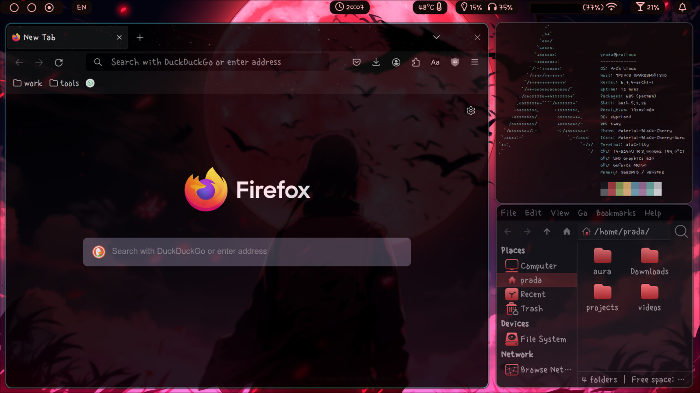

#  Dotfiles
This is the config files i am currently using in my hyprland setup.

## Dependencies
### Main
```
alacritty
tofi
neofetch
waybar
swaync
thunar
hyprshot
```
### Secondary
```
firefox
code
nwg-look
```
### Theme and font
```
Font: Singular Day (yes sorry.)
Theme: Material-Black-Cherry
Icons: Material-Black-Cherry-Suru
```
## Screenshots



